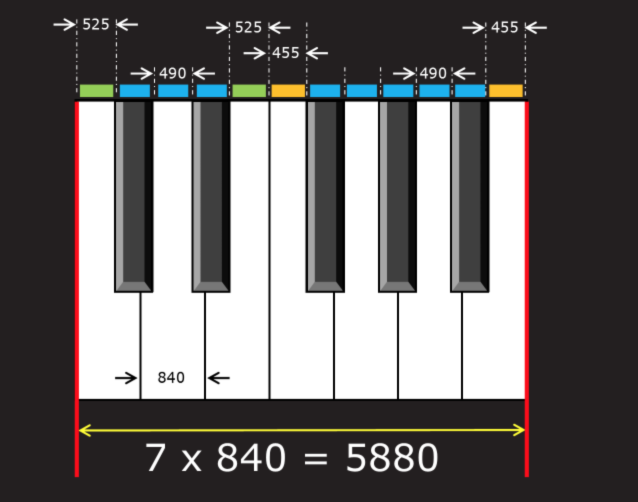

# Initial Comments & Thoughts (4/19/2018):
**Goal:** I decided to make a full 88-key virtual piano that can
be played with a computer keyboard.  

**The Piano Layout:**
I realized that most computer keyboards don't have 88 keys (my mac only has 79).
As a result, I tried to figure out how I could still allow the user to play all
88 keys. I quickly realized that I needed to have an "octave shifting" option.
I eventually decided to allow the user to choose from five different 48-key
layouts on the piano keyboard.  

**The Computer Keyboard Layout:**
After I decided how I would split/set up my piano keyboard, I tried to find the
most optimal set of 48 computer keys for the user to play with. Additionally, I
tried to pick a 48-key layout that works for any computer.  

To choose from the virtual piano's five different 48-key layouts, I will allow
the user to use the left and right arrow keys to shift layouts.  

**Graphics:**
- Each 48-key layout will be outlined with a unique color.
- Every pressed key will light up in accordance to the current layout's outlined color.

# Problems, Solutions, and Notes:
- **sound:** I tried to find the highest quality piano sounds for all 88 keys. I ended up
downloading and converting piano sounds that were recorded by a Steinway Piano
at University of Iowa's Music School.  
http://theremin.music.uiowa.edu/MISpiano.html  

- Additionally, I had to edit all 88 audio files in Audacity

- ### Problem: Creating and loading 88 piano keys w/ sound:  
  I originally wrote about 600 tedious, ugly, and inefficient lines of code to
  create 88 piano keys that all corresponded with the appropriate sound files. However,
  I knew there had to be an easier way, so I created a separate branch via Git to
  try and find a more efficient solution.

  **My Solution:**   
  Instead of naming my piano keys and sound objects by their formal names (a_sharp_0, b2, etc.),
  I decided to number them from 1 to 88. I then renamed the sound files by their
  numeric location on the piano. As a result, I was able to easily create sound objects,
  load the sound files, and then create corresponding piano keys in about only 30
  lines of code. On another note, successfully merging my experimental branch with my master branch
  took a little while to figure out.  

  **Drawing the Keyboard:**  
  Since a piano is not symmetric and contains black keys in between white keys,
  figuring out how to efficiently draw the keyboard was tricky, yet extremely fun.
  **I also wanted to draw a piano with the exact dimensions of a real piano.**  
  **Graphics Keyboard Process:**
  - Draw the 52 white keys first
  - Outline the white keys (This issue was solved with the ofNoFill() function)
  - Draw the 36 black keys
  - Draw the outline of the current location layout    

  #### Trickiest Aspect: Drawing the black keys   
  If you look closely at a piano, you'll notice that the black keys are not perfectly
  located between 2 white keys. In fact, only 7 of the 36 black keys are symmetrically
  located in between 2 white keys. Turns out, there are 3 different distances between
  a black key and a white key. As a result, drawing the black keys proved to be the
  trickiest, yet most rewarding part of the project.   
  I obtained the graphic from: http://datagenetics.com/blog/may32016/index.html

      
