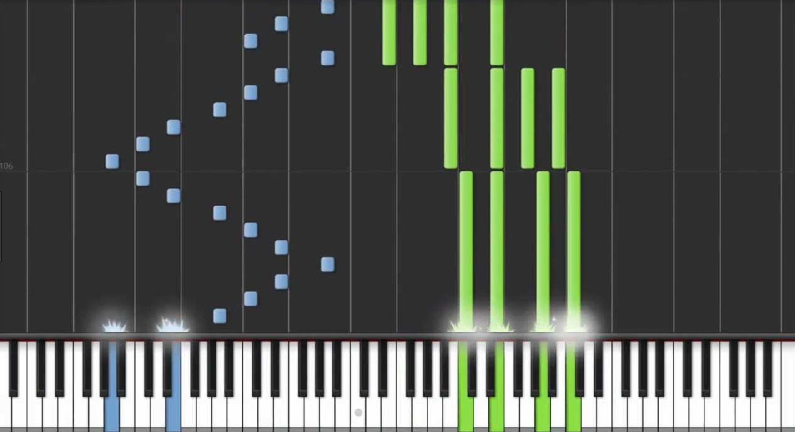
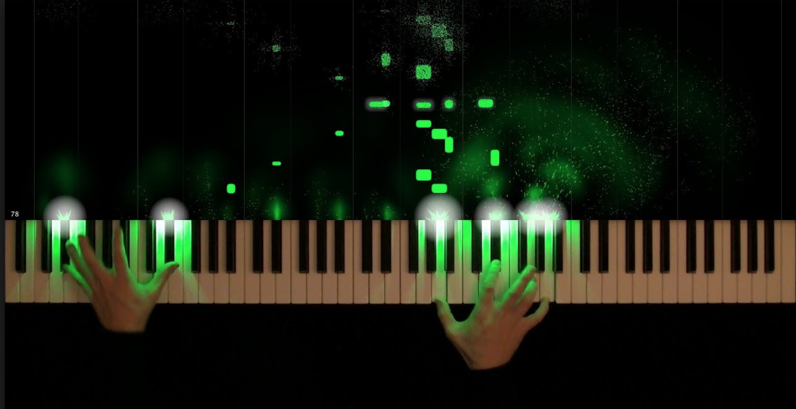

# Project Proposal

**Project Goal: Piano Visualizer**

I would like to create a Synthesia-like program that visualizes piano music.
This project is difficult to describe in words, so I've attached two pictures
down below to provide a better understanding of what I want to create.

My program will be able to take piano MIDI files and create visual tutorials out
of them. The end result will be a VIDEO that looks like something similar
to the two pictures shown above.

**Example:**
Let's say I'm not very good at reading sheet music, but I really want to play
Beethoven's Moonlight Sonata on the piano. What I can do is get a MIDI file of
Moonlight Sonata, and then input that MDII file into my Synthesia-like program.
The program would then create a video that takes me through all the notes played
in Moonlight Sonata. Of course, all the notes will also be accompanied by their
appropriate sound.

**The openFrameworks sound modules I might use:**
- ofxCoreMIDI
- ofxMidi
- ofxMidiClock
- ofxMidiFileLoader
- ofxMidiLab
- ofxThreadedMidiPlayer
- ofxUIMidiMapper

**Other openFrameworks modules**

I plan on using different 2-D graphics modules for the majority of the project.
If I have time, I may try to play around with some 3-D graphics.
