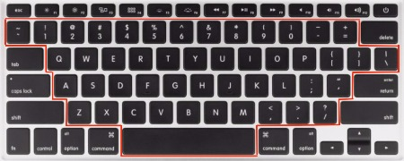
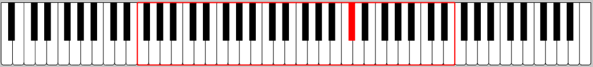
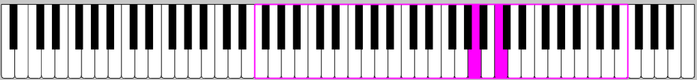
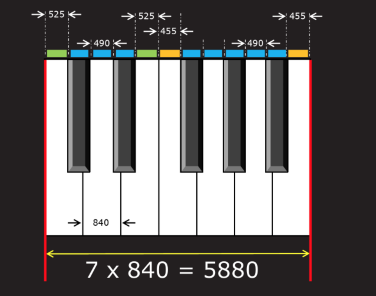

# **88-Key Virtual Piano**  
I created a full 88-key virtual piano that can be played with a computer keyboard. I used **C++ openFrameworks** for processing/loading graphics and sound.

## How to Play the Virtual Piano:
Not all computer keyboards have 88 keys, **so the virtual piano only requires 48 computer keys to be played.** As depicted in the image below, all 48 keys are within the red outline. The first key starts at the very top-left of the outline, and the last key is at the very bottom (space bar).

The user can pick from the piano's **5 different 48-key layouts** by using the left and right arrow keys on their computer keyboard. As a result, the 48 computer keys correspond to any of the 48-key piano layouts.  

#### Demo:  
When you first run and open the virtual piano, you will be able to play the default 48-key layout as shown below:

    

  If you would like to move to the right on the virtual piano, you can press the right arrow key on your computer keyboard. As a result, you will now be able to play on the 48-key layout as depicted below:  

  

**You may continue shifting across the piano's 5 different 48-key locations with the arrow keys.** Additionally, each layout will be highlighted with a distinct color. Similarly, every key that is pressed will light up in the color of the layout's outline.

## Aspects of the Keyboard:
I tried to create a keyboard with the exact dimensions of a standard piano. I based my dimensions off of the graphic down below:  

     
  Image URL: http://datagenetics.com/blog/may32016/index.html  

### Sound:  
I edited all 88 piano key sounds and converted them to mp3 files. I also renamed all the audio files for easier loading and handling. To load and play the audio, I used openFrameworks' **ofSoundPlayer** Library.  

I used piano sounds that were recorded by a Steinway Piano at University of Iowa's Music School.  
http://theremin.music.uiowa.edu/MISpiano.html  

**Graphics:**
I used openFrameworks' **ofxGui** Library to draw my graphics.

### Future Plans:
**Features I'd like to add:**  
- Label each piano key w/ the corresponding computer key
- Use computer mouse to play piano keys
- A recording/playback feature

I would still like to eventually make a Synthesia-like program that visualizes piano. This would involve MIDI processing and more advanced graphics.
